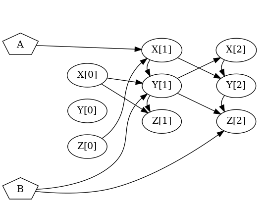

# Files for getting statistics

aaaaa [alalala](#ref_examplefile_withstoreddbn)

## File compareVars.py

* Allows getting several statistical indicators regarding the comparison of true values and respective predictions, for a certain variable throughout multiple timesteps.

* The true values are given as time-series, where the timesteps must start in 0 and are identified as __
  * An example of a CSV file with time-series, for four ids (1, 2, 3 and 4), three variables (X, Y and Z), and three timesteps (0, 1 and 2) is given next. The order of the variables must be the same in all timesteps! This example will be referred as example_correctLabels_0.csv:

```
          REF,X__0,Y__0,Z__0,X__1,Y__1,Z__1,X__2,Y__2,Z__2
          1,-1,-1,-1,2,2,2,3,3,3
          2,-1,-1,-1,9,9,9,3,3,3
          3,-1,-1,-1,2,2,2,1,1,1
          4,-1,-1,-1,2,2,2,3,3,3
```


* The predictions for a certain variable are given in a file where the timesteps must start at 1 and are identified as [ ]
  * An example of a CSV file with predictions for variable X until timestep 2, for four ids (1, 2, 3 and 4), is given next. This example will be referred as example_estimatedLabels_0.csv:

```
          id,X[1],X[2]
          1,2,3
          2,2,3
          3,2,3
          4,2,3
```

* The program receives a filesToCompare.csv argument. In each line of this file, there must be the file with the true values and then the file with the respective predictions.
  * An example of a line of a file filesToCompare.csv is

```
          example_correctLabels_0.csv,example_estimatedLabels_0.csv
```

* If there was also a file example_correctLabels_1.csv with some true values and a file example_estimatedLabels_1.csv with respective predictions, the file filesToCompare.csv could use all files presented (the ones ending in _0 and _1), being written as
  
```
          example_correctLabels_0.csv,example_estimatedLabels_0.csv
          example_correctLabels_1.csv,example_estimatedLabels_1.csv
```

* Note that the files example_estimatedLabels_0.csv and example_estimatedLabels_1.csv must estimate the values of the same variable (X in the given example).
  * This is generalizable for any number of files with predictions inserted in filesToCompare.csv!!

* Other arguments of program:
  * outputPath: the path in which the file with results is written (put . to write in the same directory of the program!).
  * timestepUntilCheckVar: program checks the predictions of varToCheck (explained next) from timestep 1 until timestep timestepUntilCheckVar.
    * timestepUntilCheckVar must be between 1 and the maximum timestep for which there are predictions in the prediction files of filesToCompare.csv!!
  * minTimestepLengthSeries: minimum size of the time-series (in the files with true values) that program considers for getting the statistics.
  * maxTimestepLengthSeries: maximum size of the time-series (in the files with true values) that program considers for getting the statistics.
  * varToCheck: must be the same variable that is in the prediction files of filesToCompare.csv (in the given example it would be X).

* To exemplify the usage of the program, the following files are provided:
   * example_filesToCompare.csv
   * example_correctLabels_0.csv
   * example_estimatedLabels_0.csv
   * example_correctLabels_1.csv
   * example_estimatedLabels_1.csv

* By running...
```
    python compareVars.py example_filesToCompare.csv . 2 0 3 X
```

* ...the program will:
  * First of all, in all explanations given next, the program only considers the predictions for time-series with lengths between 0 and 3 (which are all situations in this example, to ease the explanation).
  * Compare the true values of X__1 with the predictions X\[1\]
    * It does this considering the true values in example_correctLabels_0.csv and respective predictions in example_estimatedLabels_0.csv and also considering the true values in example_correctLabels_1.csv and respective predictions in example_estimatedLabels_1.csv
  * Compare the true values of X__2 with the predictions X\[2\]
    * It does this considering the true values in example_correctLabels_0.csv and respective predictions in example_estimatedLabels_0.csv and also considering the true values in example_correctLabels_1.csv and respective predictions in example_estimatedLabels_1.csv
  
  * Write the results into file "output_stats.csv". This output has several statistical indicators regarding the comparisons made.
    * For example, for the comparison of X__1 with X\[1\]:
      * example_correctLabels_0.csv has 4 subjects and example_estimatedLabels_0.csv predicts correctly the value of X\[1\] in 3 subjects.
        * The only wrong prediction is bellow the true value.
      * example_correctLabels_1.csv has 4 subjects and example_estimatedLabels_1.csv predicts correctly the value of X\[1\] in 3 subjects.
        * The only wrong prediction is above the true value.
      * Therefore, considering all files with true values and respective predictions, there are 8 values of X__1, for which there are 6 correct predictions. From the 2 wrong predictions, one is above the true value and the other is bellow the true value.
        * Therefore:
          * The accuracy is 6/8=0.75 (or 75%).
          * The % of predictions above is 1/8=0.125 (or 12.5%).
          * The % of predictions bellow is 1/8=0.125 (or 12.5%).

    * The 1st quartile for a variable X in timestep t is obtained considering all values of X__t in the files with the true values (files example_correctLabels_0.csv and example_correctLabels_1.csv in the given example). 
      * Then, given this quartile, referred as Q1 in the next table, each prediction (in the files example_estimatedLabels_0.csv and example_estimatedLabels_1.csv of the given example) is classified as True Positive (TP), False Negative (FN), False Positive (FP) and True Negative (TN) with the following table:

                                                 Predicted
                                    | prediction<=Q1 | prediction>Q1   
                    ----------------+----------------+----------------
                          true<=Q1  |       TP       |      FN
                    True -----------+----------------+----------------
                          true>Q1   |       FP       |      TN        

      * Having all TP, FN, FP and TN determined for the predictions of a variable X in timestep t, the respective sensitivity, specificity and AUC are determined (using standard expressions).
  
* A detailed explanation of the indicators calculated in this program is provided in the Master's Thesis of Tiago Leao.
  * See: *Section 7.2.1 Prediction of the variables’ values*
  
* Run "python compareVars.py -h" to get usage of program.

* Run "python compareVars.py -e" to get example of filesToCompare.csv.


## File getParentsCountsOfTimesteps.py

bla bla bla

<p align="center" id="ref_examplefile_WithStoredDBN">
  
</p>


